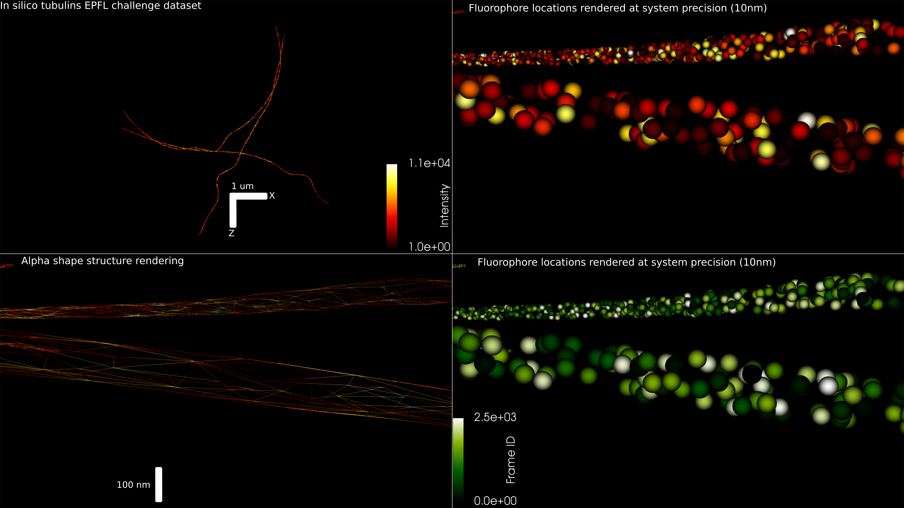

# Superresolution visualization of 3D protein localization data from a range of microscopes

[](https://anaconda.org/bcardoen/smlmvis)
[](https://badge.fury.io/py/smlmvis)

Read, analyze and visualize SMLM localization data quickly from a wide range of localization algorithms.


Example rendering of EPFL challenge dataset ['MT0.N1.HD'](http://bigwww.epfl.ch/smlm/challenge2016/datasets/MT0.N1.HD/Data/data.html)

See demo.ipynb for example usage.

## Requirements
### Python
* vtk
* numpy
* jupyter
* pandas
* seaborn
* requests
* scipy

See requirements.yml for Conda, piprequirements.txt for pip
### Optional
* [Paraview](https://www.paraview.org/)

## Gif of install


## Supported Microscopes/Algorithms
* **EPFL** Challenge:
  * epflreader.EPFLReader('data.csv')
  * [source](http://bigwww.epfl.ch/smlm/challenge2016/datasets/MT0.N1.HD/Oracle-AS/index.html)
* **Leica GSD**
  * gsd.GSDReader('test.bin') # with test.desc in same folder,
  * gsdreader.GSDReader('test.ascii', preprocess=True, binary=False) # ASCII format
  * (needs pixel to nm conversion (e.g. *160 nm /px) : obj.points *= X
  * [source](https://www.leica-microsystems.com/products/light-microscopes/p/leica-sr-gsd-3d/)
* **Tafteh et al** dSTORM with z-drift correction (LSI - UBC)
  * dlpreader.DlpReader('test.3dlp')
  * [source](https://onlinelibrary.wiley.com/doi/abs/10.1002/jbio.201500140)
* **Rainstorm**
  * db = rainstormreader.RainStormReader('data.csv') # Automatically finds pixel to nm
  * [source](https://titan.physx.u-szeged.hu/~adoptim/?page_id=582)
* **Abbelight**
  * ab = abbelightreader.AbbelightReader('data.csv') # in Nm
  * [source](https://www.abbelight.com/)

## Install
### PIP
```bash
$pip install smlmvis
```
### Conda
```bash
$conda conda install -c bcardoen smlmvis 
```

### Local from git master
```bash
$git clone git@github.com:bencardoen/smlmvis.git
$pip install .
```

## Usage
See demo.ipynb for example usage.

A typical workflow is
* use one of the readers (e.g. GSDReader in smlmvis.gsreader) to load in the SMLM data
* process the point cloud (obj.points) or compute statistics on the metadata (obj.values)
* write out the data to vtk/paraview format using e.g. VtuWriter in vtuwriter


## Cite
```latex
@misc{Cardoen2019,
  author = {Cardoen, Ben},
  title = {Superresolution visualization of 3D protein localization data from a range of microscopes},
  year = {2019},
  publisher = {GitHub},
  journal = {GitHub repository},
  howpublished = {\url{https://github.com/bencardoen/smlmvis/}}
}
```
## Tests
See tests/test_writer.py

This will download the challenge data set, read it, decode it, write it to VTK and compare with a reference.

## Acknowledgements
VTU writing code uses the VTK examples heavily to figure out how to interface with VTK.
* [VTK Python API](https://lorensen.github.io/VTKExamples/site/Python/)
